# tictactoe

## Try it here: https://tictactoe.codewithzeal.com
Multiplayer Tic Tac Toe game

## On Phone -
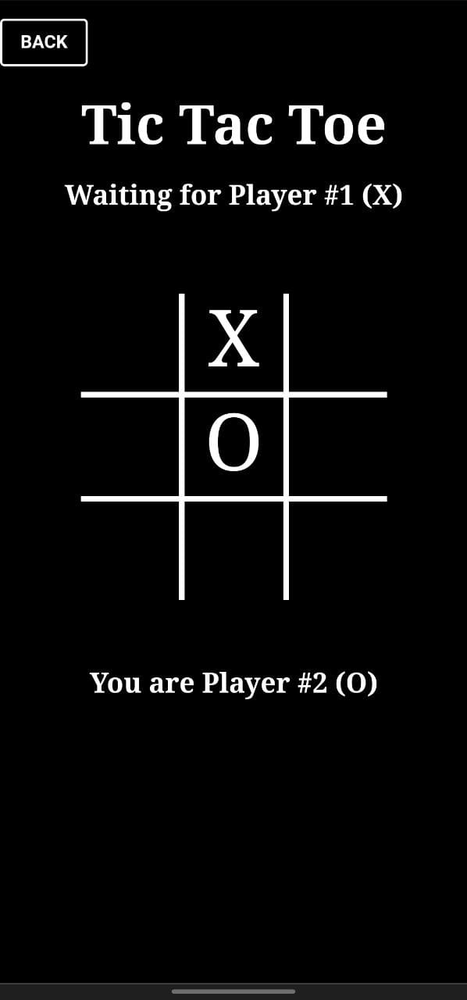

## On Desktop -
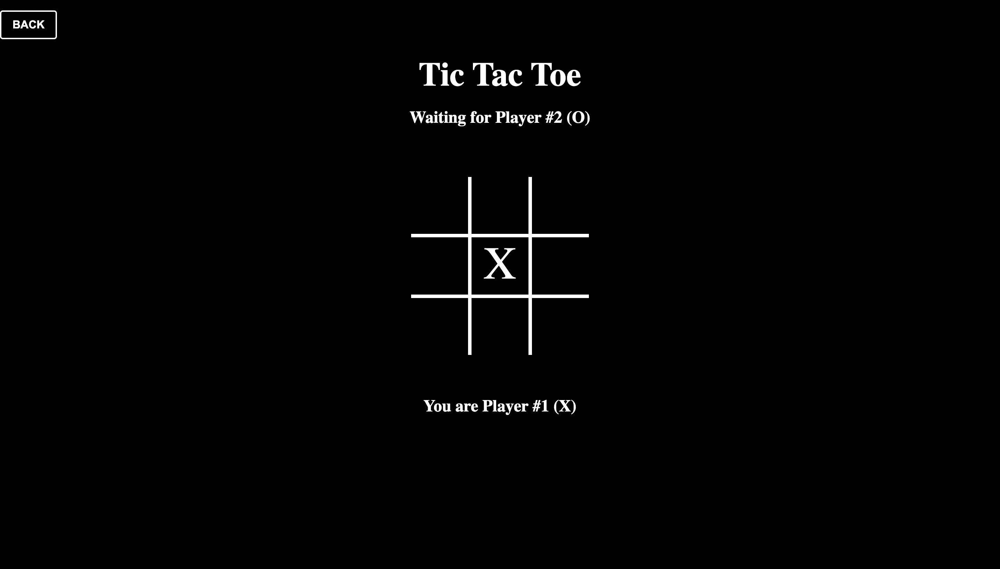

## How to play

1) go the link : - https://tictactoe.codewithzeal.com
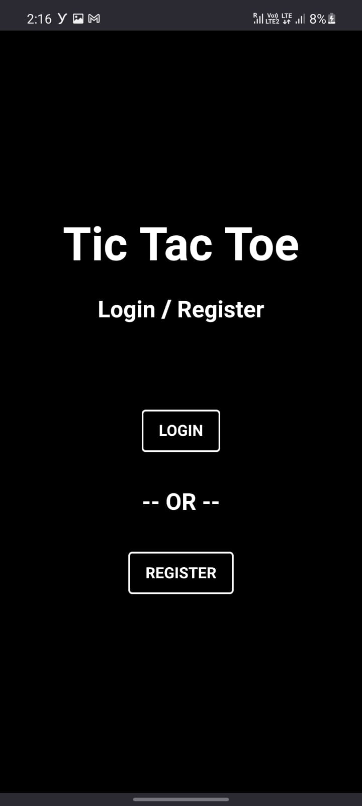
2) register/login yourself
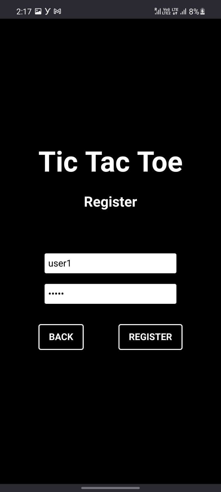
3) START => CREATE GAMEROOM (make note of gameroom ID)
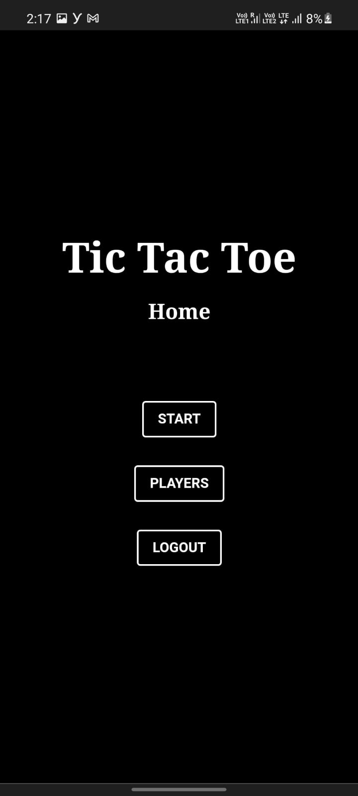
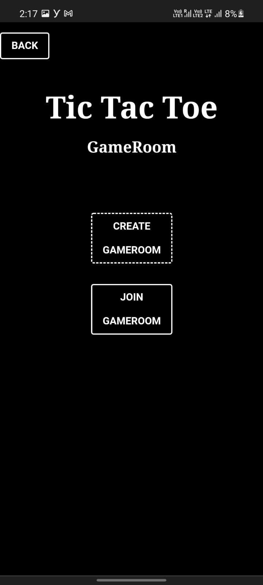
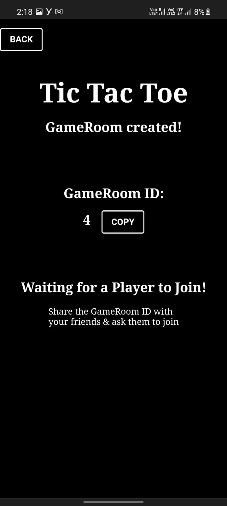
4) register/login from another device with a different username
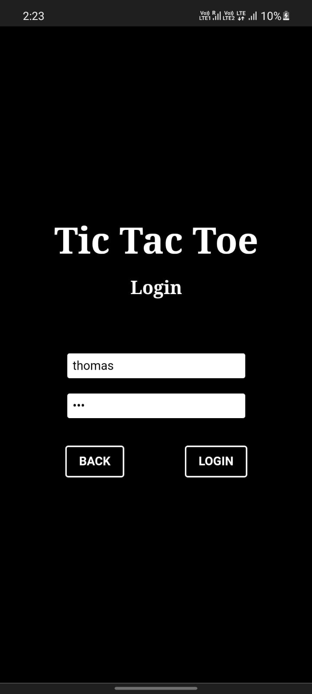
5) START => JOIN GAMEROOM (put the gameroom ID from step 3)

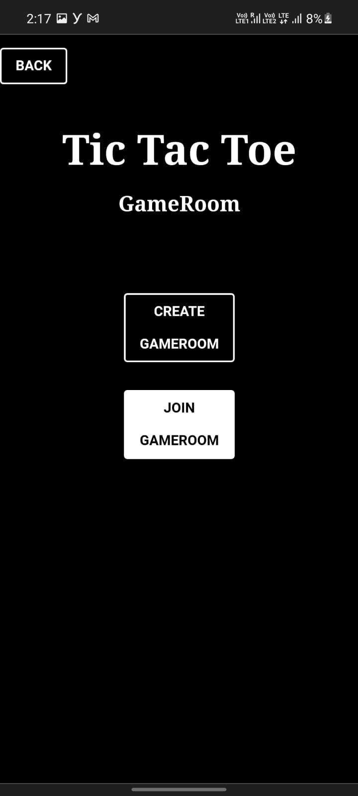
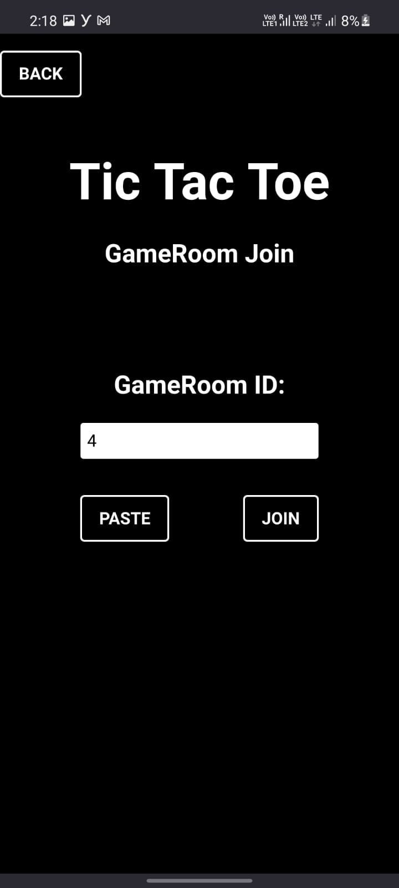
6) accept invite
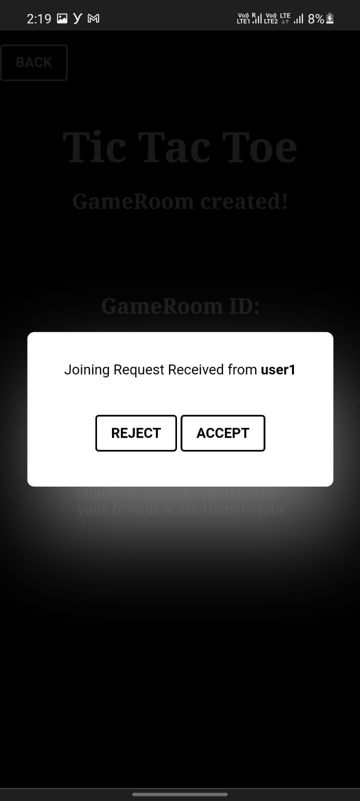
7) start palying!
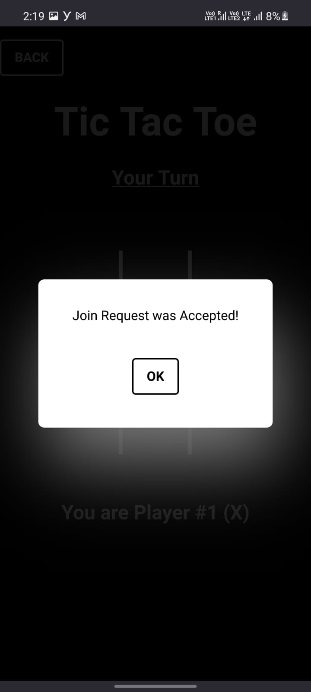
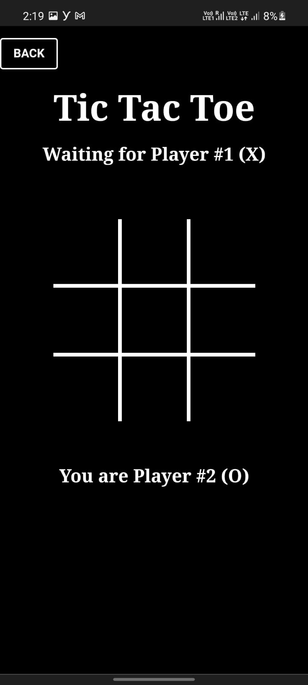

## Technologies used to build the game
1) Node.js (packages: uuid, uWebSocket.js)
4) HTML, CSS, Javascript

## Enjoy!
